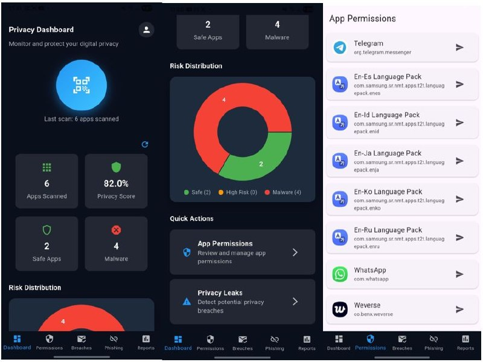
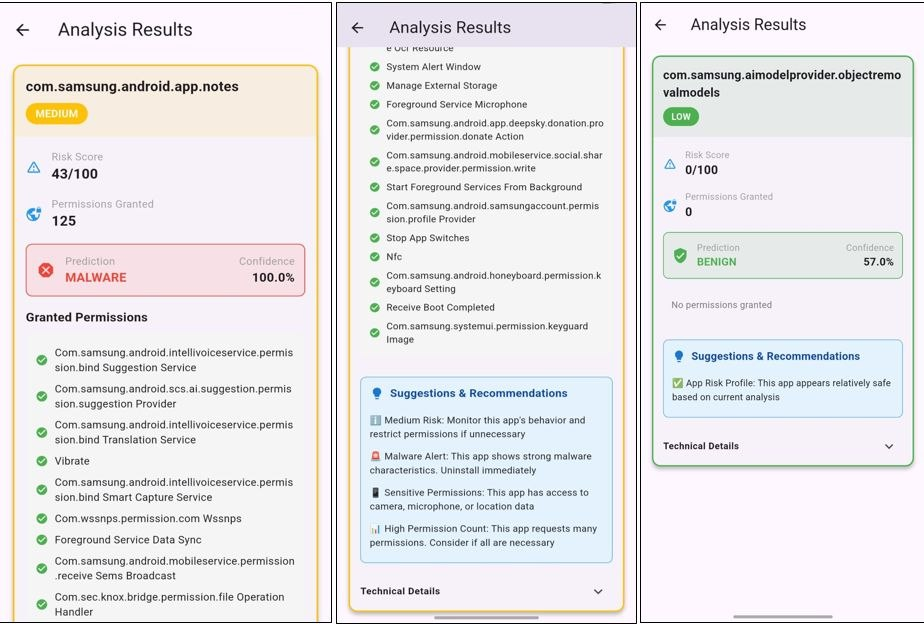
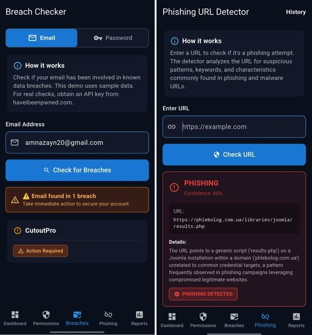
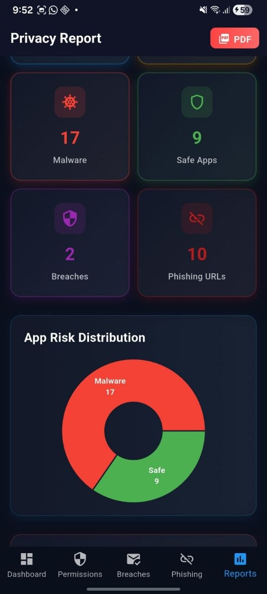
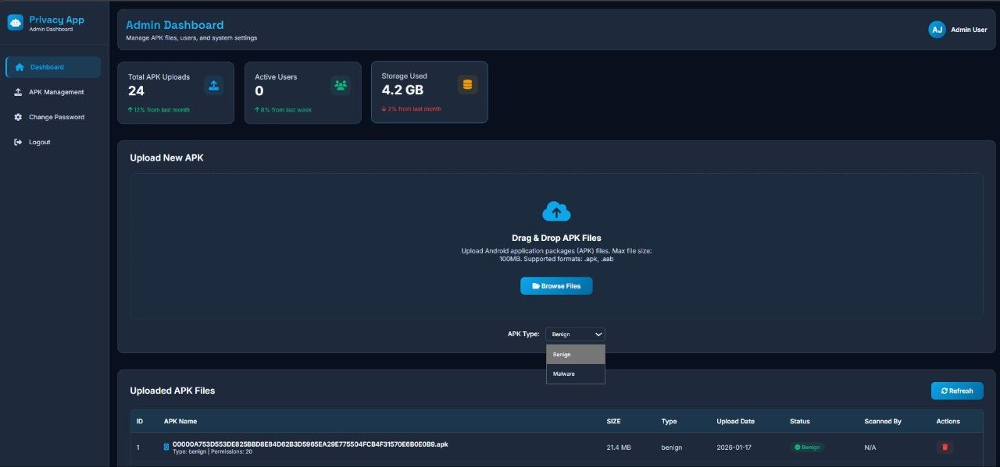

# AI-Driven Leak Detection System for Data Privacy in Mobile Platforms

## 📌 Overview
A Flutter-based mobile application that uses AI to analyze Android application permissions and identify potential privacy risks.

## ✨ Features
- AI-based permission risk analysis
- Privacy score dashboard
- Have I Been Pwned (HIBP) API integration
- Real-time breach alerts
- User-friendly Flutter interface

## 🛠 Technologies Used
- Flutter
- Django (Python)
- SQLite / Database
- REST API
- Machine Learning

## 📱 Application Screenshots

### 📊 Privacy Dashboard
The dashboard provides an overview of scanned applications, privacy score, malware detection results, and risk distribution.

---

### 🔍 Permission Analysis
Displays detailed permission analysis, AI-based malware prediction, confidence score, and security recommendations.

---

### 🌐 API Integration (Breach Checker & Phishing Detection)
The application integrates with external APIs to detect email/password breaches and identify phishing URLs.

---

### 📈 Privacy Report
Shows malware count, safe applications, breach statistics, phishing reports, and graphical risk analysis.

---

### 🖥️ Admin Dashboard
Admin panel used for APK upload, application management, and malware dataset administration.

## 👥 Team Project
Developed as a B.Tech Final Year Project.
